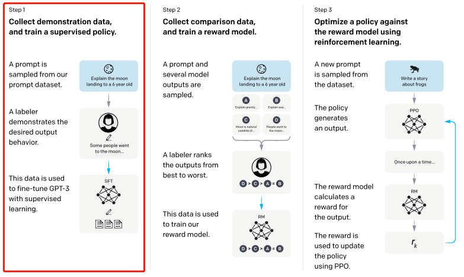
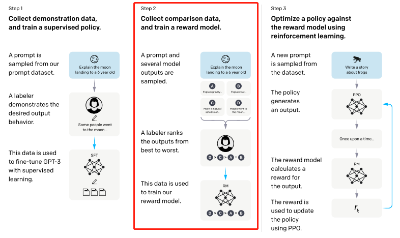
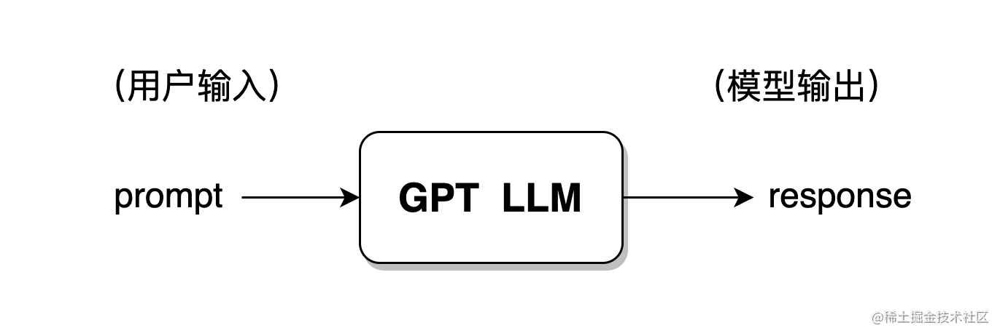
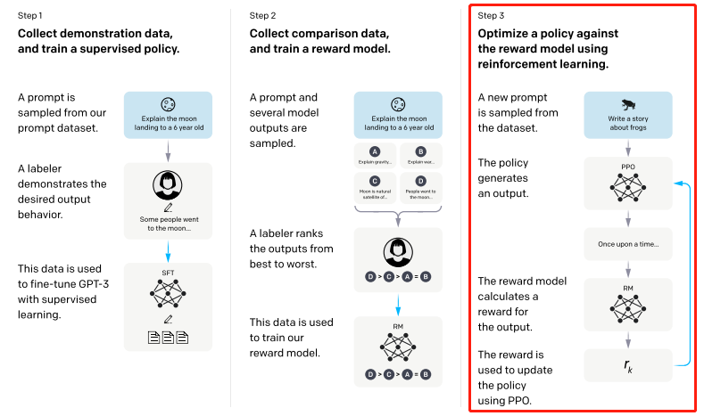
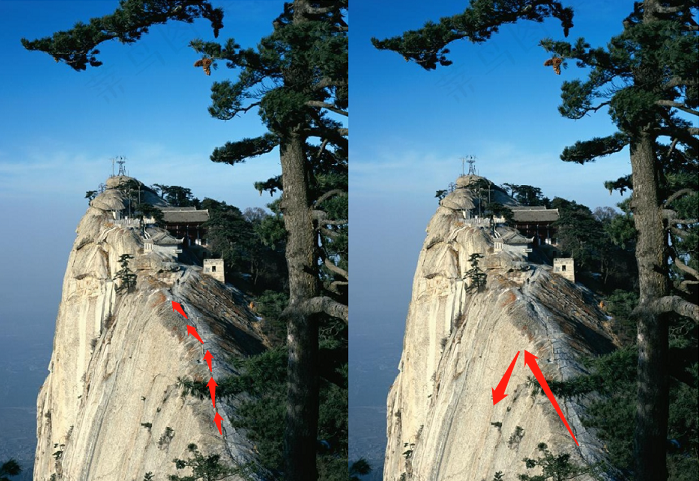
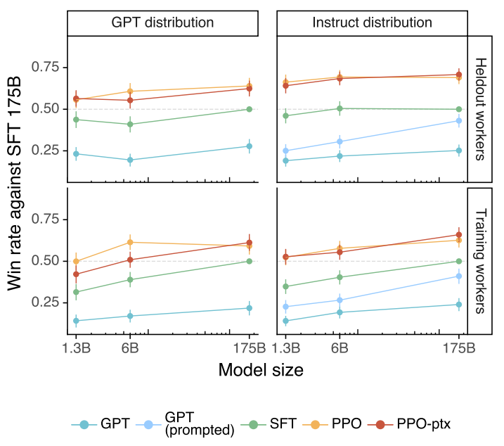

第 10 节中，我们介绍了强化学习的基本原理，以及在 NLP 领域应用的一些困难点，即，没有一个方便的手段（程序、函数或人力）能够对 ChatGPT 生成的内容做一个评价反馈。而 ChatGPT 已经抛弃了传统监督微调的方法，转而采用 **RLHF（Reinforcement Learning from Human Feedback）带人工反馈的强化学习**来克服这个难点。

# ChatGPT 的强化学习原理

前面提到了，想要应用强化学习，总得有一个东西来评价 ChatGPT 生成输出文本的好坏，这个操作只能由人类来完成，成本巨大。RLHF 算法本质就是**制作了一个神经网络模型，来模拟人类给 ChatGPT 模型的输出结果打分**。

它的操作流程并不复杂，具体来讲，主要有四个步骤，我们一一来说。

## Step0：预训练一个大规模语言模型

这一步做的就是之前第 3、4、5、6、7 节的内容，根据海量的高质量互联网文本语料，依据 Transformer 搭建的 LLM 模型。这是执行 RLHF 方法的前提。

  

如前所述，在这一步得到的预训练语言模型完成的还是文字接龙游戏。如下形式：

> 用户输入：**请写一篇关于环保的新闻稿。**
>
> 模型输出：**要求字数 800 字，信息充分、清晰、叙述简洁。**
>
>   
>
>
> 当我们要求模型写一篇新闻的时候，纯文字接龙的预训练模型却补充了一段写作要求。尽管输入输出连在一起，读起来上下文通顺，可却并不能满足人类的需求。

  

换句话说，它实际上并不是在回答用户的问题，听从人类的指令，更像是一个模型在接话，接下茬。

  

## Step1：训练监督模型 SFT

如果想要克服这种不回答问题，仅仅是接话的难题，最直观的解决思路就是标一些问答数据集让模型来学习。

  

在这里，OpenAI 构造了一定数量的 prompt，这些 prompt 实际上就是 ChatGPT 的输入文字，比如：

> prompt1：向一个 6 岁小孩解释什么是登录月球
>
> prompt2：我想去重庆玩，有哪些好玩的地点呢？
>
> prompt3：给我的孩子取个名字，五行属水

  

然后，找了一些数据标注人员，手工回答这些问题。例如：

> prompt1：向一个 6 岁小孩解释什么是登录月球
>
> response1：登录月球是指人类制造的飞船或者宇宙飞船成功着陆在月球表面上。就像我们在地球上生活一样，月球也是一个天体，它离地球很近，所以人类一直都对月球有着浓厚的兴趣。人类历史上第一次成功登录月球是在 1969 年，美国宇航员尼尔·阿姆斯特朗成为了第一个在月球上行走的人。所以，登录月球是人类探索宇宙的一个重要里程碑，也是人类科技发展的一个重要标志。

  

注意，这些 prompt 都是人工手动回答并查验数据准确性的。由于成本问题，其数据量势必较少，不可能像预训练 LLM 那样动辄好几百 GB 文本语料。

有了这些数据，我们就可以采用监督学习的方法，利用这些数据集微调（finetune）预训练得到的 LLM 模型，训练得到一个监督微调模型（Supervised Finetune Training Model）。这一步实际上就是（预训练+finetune 的学习方式）

  

这一步骤本质上是让 LLM 学会不要仅仅做文字接龙，要等用户说完话，再回答用户的提问和咨询。可能有读者已经明白过来，**SFT 得到的模型不就是 ChatGPT 想要的吗？**

  

> 其实，如果 SFT 步骤中，可用于微调（finetune）的语料数量足够庞大，那么 SFT 得到的结果完全可以直接发布成 ChatGPT 。但是前面我们提到，这部分数据量获取难度较大，过少的数据量很难保证一个优质的 finetune 效果。

  

## Step2：训练 Reward 模型

RLHF 方法重点是第二步，如何构建一个 reward 函数。在第 10 节中，我们提到了，强化学习的方式就是让智能体（LLM 模型）不断地从环境中接收反馈，而每次 reward 不像游戏领域写一个程序直接计算就行，而是需要人来判断模型的输出结果是否符合预期。此外，模型输出的结果怎样叫好？怎么样叫差？其间是否有个绝对的标准？有多重判断的维度？

为了解决这个问题，OpenAI 依然雇佣了一些标注人员，对 SFT 模型输出的结果做优劣判断。例如：

> prompt2：我想去重庆玩，有哪些好玩的地点呢？
>
> response2-1：重庆是一个充满活力和美食的城市，有很多值得一去的地方。以下是一些推荐：重庆洪崖洞、三峡博物馆、南山一棵树、解放碑步行街。
>
> response2-2：重庆是一个充满活力和美食的城市，有很多值得一去的地方。以下是一些推荐：重庆洪崖洞、都江堰水利工程、三峡大坝、解放碑步行街。
>
> response2-3：成都是一个充满活力和美食的城市，有很多值得一去的地方。以下是一些推荐：春熙路步行街、都江堰水利工程、华美极乐世界、少林寺。

  

我们根据同一条 prompt，反复询问 SFT 模型会得到若干条输出结果。其中：response2-1 的结果较为理想；response2-2 的结果存在着问题：都江堰、三峡都不在重庆，因此结果不可接受； response2-3 则鸡同鸭讲，完全把结果带入了成都而非重庆，完全不可接受。

  

因此，我们可以给 LLM 的结果打分，response2-1:10 分，response2-2:6 分，response2-1:2 分。但是这样的打分结果存在一定问题，一个答案的好坏，没有绝对可言，只有相对而言。因此，在制作 reward 模型时，不采用绝对分数，而只比较两条**数据对**的优劣关系：

  

> 规则：第一条 response，第二条 response：假设第一条优于第二条记 1，否则记 0，则上述三条描述重庆旅游的回复，可以得到：
>
> resposne2-1，response2-2：1
>
> resposne2-2，response2-3：1
>
> resposne2-3，response2-1：0

  

因此，我们训练 Reward 模型就是利用这些比较数据对进行的。以 3 条 response 为例，总共可以得到 3 条两两比较数据对。而如果是 K 条 response 的话，总共可以得到 $$C^{2}_K$$ 组合数的比较数据对。

  

但是 Reward 模型在建模时，依然是输入一对 （prompt，response），模型将这对问答数据做一个评价，给出一个标量值，即 Reward 值，这个值越高，说明 response 回答得越好，反之则越差。Reward 模型的建模形式如下：

  

  

所以模型训练的损失函数公式为：

$$loss(\theta)=-\cfrac{1}{C^2_K}E_{(x,y_w,y_l) \in D}[log(\sigma(r_{\theta}(x, y_w) - r_{\theta}(x, y_l)))]$$

看起来公式挺吓人，但是不用怕，说穿了其本质很简单，其中：

-   $$y_w,y_l$$ 分别是从 K 条 response 中抽取的两条，可以参考重庆旅游的例子，这样的组合对一共有 $$C^{2}_K$$ 对。
-   $$r_{\theta}(x, y_w)$$ 是 prompt $$x$$ 和 response $$y_w$$ 组合起来，经过以 $$\theta$$ 为参数的模型，得到的 reward 值。
-   $$r_{\theta}(x, y_w) - r_{\theta}(x, y_l)$$ 是一个差值，意在比较两个 response 的 reward 值的大小，实际上就是比较两个 response 的优劣。
-   $$\sigma$$ 是 sigmoid 函数，它单调递增，可以接收任意的实数，输出一个介于 $$(0,1)$$ 范围内的实数。而这个损失函数并非单独针对某两条 $$y_w,y_l$$ 做计算的，它综合了所有的数据对。因此，这实际上是一个平均值，即期望 $$E(.)$$。
-   说穿了，损失函数的本质含义就是，模型生成了两条输出文本，参数的调整方向要向着生成质量高的那条输出方向更新参数。

  

> 需要说明的是，在训练 reward 模型过程中，用到的数据量依然不大，相比预训练数据量动辄上百亿、千亿 token，制作 reward 模型只用到了几十万条数据，具体数据量情况将在第 12 节中介绍。
>
> 然而，当训练得到一个 Reward 模型之后，它可以用于预测的范围就是用户提到的、千奇百怪的 prompt，完全不局限于训练数据集提到的那些。

  

## Step3：基于 PPO 策略的 RLHF

  

接下来，我们就可以利用强化学习（RL），结合 SFT 模型和 Reward 模型实现循环训练了。在上图中，采用监督学习 SFT 的训练方式得到了一个模型，又称之为 SFT 策略；与之对应的是强化学习的方式来得到一个模型，这可以采用 **Proximal Policy Optimization (PPO)** 算法来更新这个强化学习模型的参数（这个算法的具体操作稍后介绍，这里先讲清楚 RLHF 的流程）。

因此，我们的目标是在 SFT 模型的基础上，训练一个 PPO 的 RL 模型，这个模型能够更好地用于完成用户的指令和任务。其训练过程是：

  

首先，把预训练得到的 LLM 模型复制一份出来，并且把第一步训练得到的 SFT 模型也准备好。然后，让 LLM 模型主要用于接收一条 prompt（注意，此时的 prompt 和 SFT 阶段训练的数据、Reward 模型训练的数据不同），生成一条 response。

接着，将 prompt 和 response 输入 Reward 模型，得到一个 reward 值。最后根据这个值，利用 PPO 算法的策略，更新复制出来的 LLM 模型参数。

  

具体的策略算法优化目标公式为：

$$objective(\phi)=E_{(x,y) \in D_{\pi^{RL}_{\phi}}}[r_{\theta}(x,y)-\beta log(\cfrac{\pi^{RL}_{\phi}(y|x)}{\pi^{SFT}_{\phi}(y|x)})] +\gamma E_{x \in D_{pretrain}}[log(\pi^{RL}_{\phi}(x))]$$

-   这个公式乍一看很吓人，但不用害怕，我们一点点来解析。
-   -   $$r_{\theta}(x,y)$$ 就是将一条 prompt $$x$$ 和 response $$y_w$$ 组合起来，经过以 $$\theta$$ 为参数的模型，得到的 reward 值。强化学习就是**根据 reward 奖励值来更新模型的参数**，在这里，我们希望 reward 值尽可能的大，这样模型输出的结果更符合人的预期。
    -   在第 10 节中，我们讲到策略本质是一个条件概率分布，是输出 response$$y$$ 关于 prompt $$x$$ 的条件概率分布 $$p_{\theta}(y|x)$$，这实际上就是 LLM 的语言建模条件概率，但是在强化学习中，我们一般记为 $$\pi_{\phi}(x,y)$$。
    -   $$\pi^{SFT}_{\phi}(x,y)$$ 是指通过 SFT 模型得到的模型，$$\pi^{RL}_{\phi}(x,y)$$ 是指通过强化学习得到的模型，也就是我们要学的目标。$$log(\cfrac{\pi^{RL}_{\phi}(y|x)}{\pi^{SFT}_{\phi}(y|x)})$$ 实际上是两个分布的相对熵，即 KL 散度【[信息熵、交叉熵、相对熵](https://mp.weixin.qq.com/s/YP3SixzbgWPpvx-1xzeodQ)】。它描述了两个概率分布的差距。在这个公式中，我们希望利用 SFT 方法训练得到的模型和强化学习方法学习到的模型尽量相似。其本质含义是，OpenAI 的工程师们担心，仅通过 reward 训练得到的模型会导致模型的输出结果产生不可预知的行为。这也是 PPO 算法的一部分。
    

-     此外，$$E_{x \in D_{pretrain}}[log(\pi^{RL}_{\phi}(x))]$$ 这一项就是预训练 LLM 的损失函数。只不过，在这里是以策略分布的形式表示的。预训练 LLM 的学习目标是文字接龙，即模型能够丝滑地说出一段非常连贯的话语。在这里，它的含义是，希望强化学习得到的模型能够尽可能地像人一样讲话，不会产生一些奇怪的行为，例如：
-   > prompt：请问北京有什么好玩的景点？
    >
    > 带预训练语言模型目标的 response：北京的好玩景点非常多，包括故宫、颐和园、香山、世贸天阶等等。
    >
    > 不带预训练语言模型目标的 response：北京有故宫颐和园香山世贸天阶。
   

-     从这个例子中可以看出，若目标函数中不带预训练学习目标一项，尽管它回答的内容没错，也没有任何恶意，但是这句话过于简略，没有标点停顿，不像是一个人说出的话。
-     还需要注意的是，这一项前面有一个参数项 $$\gamma$$，当它为 0 的时候，这个预训练项不存在。
-     最后，这里所有的数据都不仅仅针对某一条而言，而是所有数据的平均，因此，都是以期望形式 $$E(.)$$ 进行计算。

-   每一次迭代，强化学习算法都根据 Reward 模型给出的评估值，更新 $$\pi^{RL}_{\phi}(x,y)$$ 的参数，最终得到一个令人满意的效果。

  

解释完 RLHF 算法的操作流程之后，我们大致可以看出，该算法的工作流程其实就是从模型中抽取数据，再交由 Reward 模型给出优劣评价，更新模型参数，反复迭代。这就好比一个体操运动员和教练的关系。

  

> $$\pi^{RL}_{\phi}(x,y)$$ 策略（要训练的模型）就像是一个体操运动员，做出一套体操动作；
>
> $$r_{\theta}(x,y)$$ 值就像是一个教练员，根据运动员的动作，给出打分和评价，并要求模型根据要求做出动作改进；
>
> $$\pi^{SFT}_{\phi}(x,y)$$ 就像是另一个前辈体操运动员，后辈运动员一边要听从教练的指挥，同时也要参考前辈运动员的动作，其动作标准也不能和前辈运动员的水平产生太大的出入。
>
> 训练过程中如此反复，才能提高体操竞技水平。

  

### PPO 算法

所谓 **Proximal Policy Optimization （PPO，近端策略优化）** 算法，其概念较为繁复，流程也较为抽象。因此，这里将丢开这些，直观地讲清楚 PPO 算法的底层逻辑。

  

强化学习中，有两种学习策略，即参数更新策略（即强化学习模型参数），**on-policy** 和 **off-policy**。

-   on-policy 学习策略是指利用当前策略收集数据并学习更新当前策略。也就是说，它通过评估当前状态下各种行动的价值来更新当前策略，从而使得策略更加优化。
-   off-policy 学习策略则是指利用其他策略产生的数据来学习更新当前策略。也就是说，它利用历史数据来训练当前策略。

on-policy 和 off-policy 的主要区别在于它们更新策略的方式不同，前者是通过当前策略产生的经验数据来更新策略，后者则是利用历史经验数据来对当前策略进行更新。用一张图来表示，

> 阿光自己亲自下棋，他既实际出手（执行策略动作），又不断思考（更新策略参数），这属于 on-policy。
>
> 阿光看别人下棋，他不实际出手（换另一个模型，即佐为，执行策略动作），仅思考学习（更新策略参数），这属于 off-policy。

  

在上述例子中，如果采用 off-policy 方式，阿光非常聪明，佐为非常笨，阿光在一旁看见佐为的臭棋都想骂人，那阿光此时很难学到什么精进的技术。 就是说，执行动作的策略（SFT 策略）和更新参数策略（RL 策略）不是一个模型策略，若两策略差别过大，则学习效果不理想。

因此，**我们希望给学习目标函数增加一个条件，即两个策略不能差别太大**，在例子中，佐为和阿光的下棋水平应当相近，这样才能真的学到东西。**这就是 PPO 算法的本质**。

  

衡量两个模型概率分布的最直观方法，就是相对熵（KL 散度），这其实就是上一节 PPO 策略中添加的相对熵项。

  

另一方面，相对于监督学习，强化学习算法的训练是比较困难的，难就难在模型参数很难收敛。

> 如果说监督学习是在学习骑自行车的话，那么强化学习就像是在学习骑独轮车。在模型训练中，都是根据目标函数或损失函数的梯度来进行参数迭代的，如果梯度爆炸，或梯度消失，就类似于学习骑车翻车，学习失败。

  

在强化学习中，对目标函数的拟合类似于沿着一座山向上爬，只有当爬山的步幅较小时，模型参数才能够正确地收敛（如图左），而当爬山步幅太大时，则会直接导致模型的训练失败（如图右）。

  

为了使强化学习的训练过程更加稳定，PPO 算法也可以理解为一种 clip 优势值的方式，来确保模型训练的稳定。

$$L^{CLIP}(\theta)=E_t[min(r_t(\theta)A_t,clip(r_t(\theta), 1-\epsilon, 1+\epsilon)A_t]$$

这个公式就是 PPO 算法的优化公式，看起来复杂，但你不必细究，其核心在于其中的 clip 函数，含义为，如果 $$A_t^{\pi_k}$$ 的值过大，很可能导致模型训练的不稳定，因此要被限制在一定范围内，确保每一步步长都是稳定的。**clip 优势值和相对熵的理解方式是等价**的，说的是一回事。

  

如果感兴趣，还可以看看详细的【[PPO 算法介绍](https://www.bilibili.com/video/av24724071/?p=4&vd_source=90177483d5c9b8737e88930eafc501d4)】【论文：[Proximal Policy Optimization Algorithms](https://arxiv.org/pdf/1707.06347.pdf)】。

  

# RLHF 方法的效果

这幅图展现了 RLHF 方法所提到的优劣对比，图中 GPT 指的是原始的预训练模型，SFT 为经过第一步监督学习之后得到的模型，PPO 即根据前述目标函数，当 $$\gamma=0$$ 也就是不加预训练学习目标时学习到的模型，PPO-ptx 则是加了预训练学习目标时学习到的模型。

图中，是准备一套测试问题文本，分别去向各种不同策略训练得到的模型提问。如果提问结果比 SFT 175B 模型（指1750 亿参数量的模型）得到的回答更加优质，则判定模型更优，反之， SFT 175B 模型更好。显然，SFT 175 B 模型的取值是 0.5，意指它自己和自己比，既不好，也不坏。

而在图中，红色、橙色的 PPO 的方法整体要比 SFT 方法效果好很多。

  

# RLHF 方法的本质

在第 10 节中，我们提到了强化学习的本质就是让模型在环境中自适应学习，达到适者生存的状态。而对于 NLP 而言，这个环境是整个现实世界。

  

整个现实世界的复杂度过高，完全不可能通过计算机来拟合，因此，**OpenAI 制作了一个 reward 模型来间接地拟合了现实世界。** 如果你看过《黑客帝国》电影的话，讲真，这个 reward 模型有 **《黑客帝国》的母体 matrix** 的既视感有木有？！

> 《黑客帝国》电影中，有一个宏大而科幻的故事背景，一名年轻的网络黑客尼奥，发现看似正常的现实世界实际上是由一个名为“matrix”的计算机人工智能系统控制的。很多人生活在这个虚拟世界中，但却毫无察觉这不是真正的现实世界。
>
> 对应于 NLP 领域，虚拟世界就是 reward 模型，ChatGPT 就是生活在虚拟世界中的人。

  

对于 GPT 模型而已，**只要把预训练模型接一根管子在 reward 模型上，预训练模型就会开始像感知真实世界那样，感知 reward。**

# 总结

  

RLHF 的训练过程主要是：待模型生成数据，reward 模型给出评价，根据目标函数更新模型参数，以此往复，提高模型对用户指令的响应。

  

最后，留给读者一个开放性思考题：可否不采用强化学习的训练方法，直接把 reward 模型的结果当作损失函数微调模型呢？