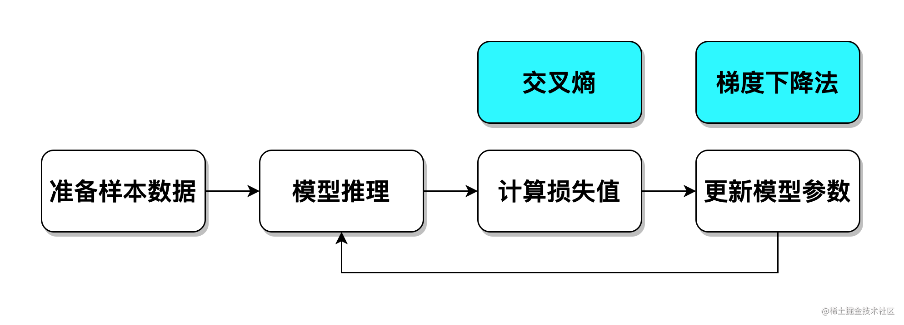
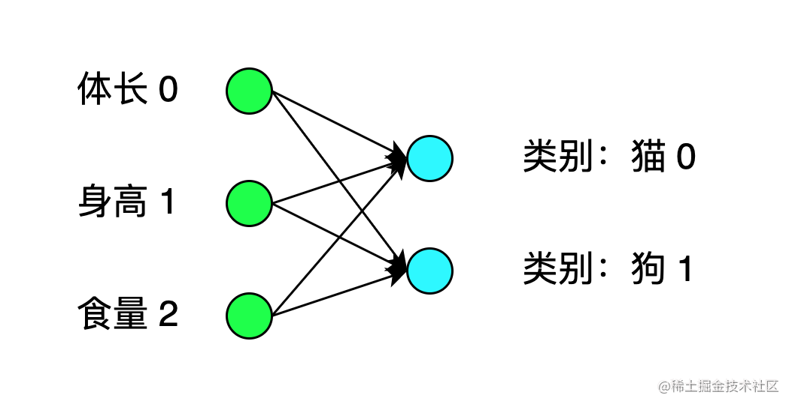
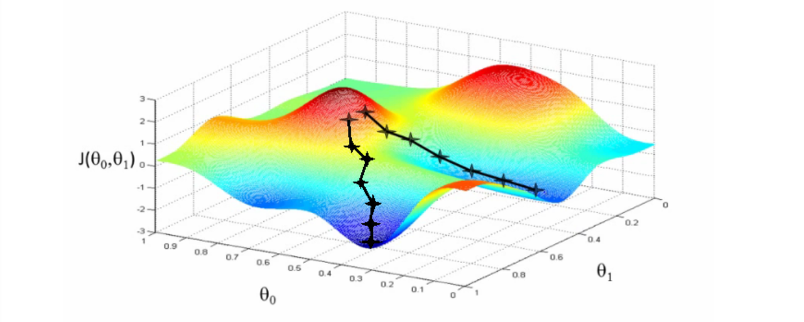
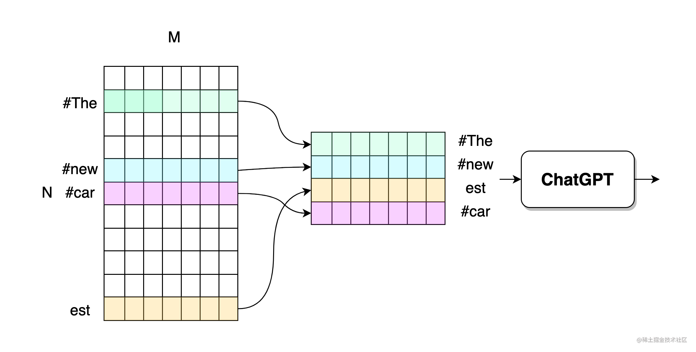

ChatGPT 模型是一个规模庞大的神经网络模型，第 3-7 节我们重点介绍了 ChatGPT 模型的详细**结构**。本节到第 11 节，我们将重点介绍如何利用数据**训练**一个 ChatGPT 模型。

  

ChatGPT 模型的训练过程主要包括**语言模型的预训练**，根据用户数据**微调（Finetune）** ，使用**强化学习方法提升模型知识涌现能力**。这几部分的本质都还是**利用随机梯度下降法，使用数据进行有监督训练**。

  

因此，考虑到非 AI 领域读者在阅读上会有困难，本节将介绍一下神经网络的训练流程和基础概念，举一个最简单的例子，帮助你充分理解模型训练的过程。

-   如果你已经具备了 AI 领域的相关知识，则可以跳过本节，继续阅读后续章节；
-   如果你还不具备模型训练的基础知识，则有两种学习方法，第一种是先通读本节内容，然后阅读后续章节，第二种是先跳过本节内容，当阅读到后续章节相关内容时，再返回到本节的基础知识做查阅。

  

# 神经网络的训练过程

目前，神经网络最常用的模型训练方法为**监督学习（Supervised Learning）** 。监督学习的目标，是通过给定的输入（ChatGPT 的输入文本）和输出（ChatGPT 的输出文本）数据来学习一个函数，使得对于新的输入数据，可以预测其对应的输出。在监督学习中，我们通常将输入数据称为特征，将输出数据称为标签或目标变量。

这样说可能还是有些抽象，我们可以打个比方。

  

> 简单来讲，监督学习就像是一位老师在教学生做题一样。老师会给学生一些已知的**问题（输入数据）** 和**答案（输出数据）** ，让学生通过观察这些问题和答案的关系，学会如何解决新的问题 **（模型拟合）** ，如考试题等等。

  

具体的监督学习流程如下图所示，蓝色部分为对应模块所使用的常用具体方法。整个模型训练过程，就是准备标注数据，根据模型推理的结果和数据标注结果，使用交叉熵损失函数对比两者的差异，使用梯度下降法更新模型的参数，以此达到模型训练的目标。

只讲概念还是太抽象了，我们来举一个例子，制作一个最简单的神经网络完成对猫狗特征的分类。

  

## 神经网络的输入和输出

在使用监督学习模型训练模型的过程中，必然要依赖已经标注好的数据，这些数据用于喂给模型作为输入，并拿标注好的输出和模型计算得到的输出做对比，以此训练模型。

  

现在假设我们有两个样本，分别标注好对应的特征和类别：

> 样本 1：体长：0.5 米，身高：0.3 米，食量：0.03 kg；类别：猫
>
> 样本 2：体长：1.2 米，身高：0.6 米，食量：0.2 kg；类别：狗

  

直观地看，一个动物，如果体型小于 0.5 米，身高较矮，食量少，那大概率是猫咪，而如果体型高大，食量大，大概率是一只狗。

  

根据这些样本，我们构造一个最简单的神经网络（单层前馈全连接线性层），其本质就是一个矩阵乘法运算，对数据做了一次线性变换，其结构如下：

其中的每一个绿色节点代表一个特征，一个蓝色节点代表一个类别结果，图中的数字代表该节点的编号牌，每一条连接线都是这个微型神经网络的**权重参数**，这些权重参数就是模型需要通过样本学习和拟合的。

模型的含义是，针对每一个样本，分别计算其属于猫和狗的值，比较得到的两个值更加偏向哪个类别。

  

假设这些权重参数分别为：$$w_{00}, w_{01}, w_{10}, w_{11}, w_{20}, w_{21}$$，其中参数的下标即节点的编号。那么，当我们计算样本 1 的结果时，就可以得到：

- 样本 1 的猫类别值：$$class_0 = 0.5w_{00} + 0.3w_{10} + 0.03w_{20}$$

- 样本 1 的狗类别值：$$class_1 = 0.5w_{01} + 0.3w_{11} + 0.03w_{21}$$

  

你可以自己尝试写一下，针对样本 2 的计算式子。

通过比较 $$class_0, class_1$$ 这两个结果值的大小，如果猫类别值比较大，说明样本属于猫，反之则属于狗。

  

## 神经网络的预测推理

在模型开始训练之前，首先需要随机初始化一套参数值，用于模型的**推理**（也叫模型的**预测**）。在 ChatGPT 中，用户每次调用 ChatGPT 回答一次问题，技术上都叫做一次模型的推理或预测。

  

针对猫狗分类的例子，假设我们有一套参数（可以用于模型训练调整的一套值）：

-   $$ w_{00}=0.5, w_{10}=-1.0, w_{20}=0.8$$
-   $$w_{01}=-0.2, w_{11}=0.6, w_{21}=-0.5$$

  

由此我们可以分别计算：

- 样本 1 的猫类别值：$$class_{10} = 0.5 \times 0.5 - 0.3 \times 1.0 + 0.03 \times 0.8 = -0.026$$

- 样本 1 的狗类别值：$$class_{11} = -0.5 \times 0.2 + 0.3 \times 0.6 - 0.03 \times 0.5 = 0.065$$

- 样本 2 的猫类别值：$$class_{20} = 1.2 \times 0.5 - 0.6 \times 1.0 + 0.2 \times 0.8 = 0.16$$

- 样本 2 的狗类别值：$$class_{21} = -1.2 \times 0.2 + 0.6 \times 0.6 - 0.2 \times 0.5 = 0.02$$

  

那么，怎么判断这些样本经过模型的预测属于哪个类别呢？

所有样本的猫狗类别值，实际上都是 log 化的概率值，通过 softmax 公式，我们可以将上述的取值，转换为真实的概率值。在第 5 节中，我们介绍过 softmax 函数。应用在上述例子，我们可以计算得到：每个样本属于各个类别的概率值：

- $$p(猫|样本1) = \cfrac{exp(-0.026)}{exp(-0.026) + exp(0.065)} = \cfrac{0.974}{0.974 + 1.067}=0.47$$

- $$p(狗|样本1) = \cfrac{exp(0.065)}{exp(-0.026) + exp(0.065)} = \cfrac{1.067}{0.974 + 1.067}=0.53$$

- $$p(猫|样本2) = \cfrac{exp(0.16)}{exp(0.16) + exp(0.02)} = \cfrac{1.173}{1.173 + 1.02}=0.54$$

- $$p(狗|样本2) = \cfrac{exp(0.02)}{exp(0.16) + exp(0.02)} = \cfrac{1.02}{1.173 + 1.02}=0.46$$

  

由此可以判断，从模型预测可以得知，样本 1 更大概率是狗，样本 2 更大概率是猫。这个结果与先前给出的真实标注数据不相符，因此需要计算两者之间不相符的差距。

  

## 神经网络的损失函数

**损失函数**是机器学习中一个重要概念，用于衡量**模型预测结果**与**真实结果**之间的差距，在这个例子中，上述模型参数预测得到的类别和真实的标注类别不一致，这就需要损失函数来衡量。

而模型的训练，就是通过优化损失函数来更新模型的参数，使得模型的预测结果更加准确。常见的损失函数是**交叉熵** **（Cross** **Entropy** **）** ，我们也以该损失函数为例，对猫狗分类的例子做介绍。

  

这里就用到了**交叉熵损失函数**。其公式形式为：

$$J(w) = -\frac{1}{m}\sum_{i=1}^{m}\sum_{j=1}^{k}y_j^{(i)}\log(h_{w}(x^{(i)})_j)$$

-   其中，$$m$$表示样本数量，例子中总共有 2 个样本；
-   $$k$$表示类别数量，在这个例子中$$k$$值为 2，即猫和狗两种类别；
-   $$y_j^{(i)}$$表示第 $$i$$个样本的真实标签是否属于第 $$j$$个类别，是则为 1，否则为 0；
-   $$h_{w}(x^{(i)})_j$$表示模型对第 $$i$$个样本属于第 $$j$$个类别的预测概率。

  

这个公式看起来的确有点抽象，我们来计算一下上面的猫狗分类例子，加深理解。

对于样本 1，$$J_1(w) = -1.0 \times \log(0.47) + 0 \times \log(0.53)=0.75 $$

对于样本 2，$$J_2(w) = 0.0 \times \log(0.54) - 1.0 \times \log(0.46)=0.776 $$

因此，总和损失值为：$$J(w) = \cfrac{J_1(w)+J_2(w)}{2}=0.763$$

  

> 交叉熵是一个**信息论**中的概念，它衡量了两个概率分布之间的差异（距离），这个值一定是大于 0 的正实数。若两个概率分布十分接近，则交叉熵值越小，越逼近于 0，反之则越大。而模型预测的结果和标签标注的结果，本身就是两个概率分布。
>
> 关于信息论的基础知识，你可以参考[【信息熵、交叉熵、相对熵】](https://mp.weixin.qq.com/s/YP3SixzbgWPpvx-1xzeodQ)一文阅读学习，其中详细介绍了信息论如何应用在监督学习中。

  

## 梯度下降法

  

从上面的例子中我们了解到，若随机设定的模型权重，会导致模型对样本的类别判断产生错误。这个错误值的大小即交叉熵损失函数值。

那么，针对上述例子，接下来就是让模型能够根据给出的两条样本数据训练模型、更新参数权重，正确地分出每一个样本是猫还是狗。此时，我们就用到了**梯度下降法**。

  

### 定义

梯度下降法是一种常用的优化算法，用于求解函数的最小值。在机器学习中，我们通常使用梯度下降法来更新模型的参数，使得损失函数最小化。 梯度下降法的基本思想是沿着函数的负梯度方向不断迭代，直到达到最小值。

具体来说，我们首先随机初始化模型的参数，然后计算损失函数$$J(w)$$对于每个参数的**偏导数**，即**梯度**$$\nabla J(w)$$。接着，我们沿着梯度的反方向更新参数，使得损失函数逐渐减小。这个过程可以通过以下公式表示：$$w=w-\alpha \times \nabla J(w)$$。

  

公式比较抽象，我们仍以上述例子阐述一下怎么进行梯度下降。

  

### 梯度下降法训练实施过程

对于样本 1，其真实的类别应该是猫。然而，模型以 0.47 的概率认为它是猫，以 0.53 的概率认为它是狗，模型更偏向该样本被分类为狗。

  

因此，我们的调整目标，是希望模型对于输出猫的概率$$p(猫|样本1)$$更大，对于狗的输出概率$$p(狗|样本1)$$更小。而 $$p(猫|样本1)$$ 和 $$p(狗|样本1)$$ 概率值，是由 $$class_{10}$$ 和 $$class_{11}$$ 值决定的，当 $$class_{10}$$ 值越大时，$$p(猫|样本1)$$ 概率值也就越大，相应的 $$p(狗|样本1)$$ 概率值也就越小。因此，我们应当使得 $$class_{10}$$ 值尽量大。

  

而对于样本 1，当 $$w_{00}$$ 权重参数值越大时，$$class_{10}$$ 值也就越大。因此，我们应当使  $$w_{00}$$ 值尽量大。其中，当我们**把** $$w_{00}=0.5$$ **权重值调大**，例如，改为 $$w_{00}=2$$ 之后，我们再计算 $$class_{10} = 0.5 \times 2 - 0.3 \times 1.0 + 0.03 \times 0.8 = 0.724$$。

而 $$class_{11} = -0.5 \times 0.2 + 0.3 \times 0.6 - 0.03 \times 0.5 = 0.065$$
保持不变。此时，再计算概率值：

$$p(猫|样本1) = \cfrac{exp(0.724)}{exp(0.724) + exp(0.065)} = \cfrac{2.062}{2.062 + 1.067}=0.659$$

$$p(狗|样本1) = \cfrac{exp(0.065)}{exp(0.724) + exp(0.065)} = \cfrac{1.067}{2.062 + 1.067}=0.341$$

  

至此，我们通过调整 $$w_{00}$$ 的值的大小，实现了模型预测样本 1 更加偏向类别为猫，概率为 65.9%，相应的分类为狗的概率是 34.1%。根据调整过的模型参数，重新计算损失函数值$$J(w) = 0.506$$（过程略去，读者可以自行尝试），损失函数的下降，表明模型的训练朝着正确的方向前进。

按此方式，我们可以把样本 2 以同样的方式进行参数迭代，除了$$w_{00}$$之外，$$w_{01}, w_{10}, w_{11}, w_{20}, w_{21}$$所有参数都可以按此方式进行迭代训练。循环往复，就可以通过给定的数据，得到一个优质的模型。

  

这样一来，我们就**通过调整模型参数权重，实现了模型的训练任务**。实际上，上述整个过程就是在利用梯度下降法实现模型的训练。当我们由 $$p(猫|样本1) \to class_{10} \to w_{00}$$ 一步步推导出每一个变量的变化时，就是在用链式求导法则做偏导数计算。

  

实际上，模型的训练过程就是一个损失函数值不断下降的过程，这个过程我们在第 5 节中简要提到过。如果把损失值比作一座山的海拔高度，那么模型训练过程就是从一座高山的山峰逐渐下来。

图中的每一个黑色十字都代表一次迭代，正如我们上述例子中$$w_{00}:0.5 \to 2$$。经过层层迭代，模型的损失函数值下降到一个极小点，这个极小点就意味着完成了训练。而图中的两条黑色线路，代表了模型参数的下降方向是随机的，这个随机性由样本和最初设定的$$w$$参数共同决定。

  

# ChatGPT 的预训练过程

了解了上述模型的训练过程，我们就可以解释 ChatGPT 模型的训练过程了。第 1 节中我们初步了解到，ChatGPT 是经过两个训练步骤得到的。

  

在第 4 节中，我们介绍了 ChatGPT 模型以 token 序列的 embedding 作为输入传入模型。

  

ChatGPT 模型的输出和前面提到的猫狗分类也非常相似。在猫狗分类中，总共对每一条样本预测分别属于猫、或狗的概率，即$$p(猫|样本)$$和$$p(狗|样本)$$。而在 ChatGPT 预训练中，以下面为例：

> 例句：jionlp 是一个好用的开源_____

那么，根据 ChatGPT 建模形式，模型的输入是 `jionlp 是一个好用的开源`，需要让模型输出下一个字是什么。

  
假设我们的 token 词表总共有 50000 个。ChatGPT 模型输出了一个 50000 维度的向量，$$d_{50000}=[0.123, -1.092, ... , 0.037]$$，其中每一个维度值都对应了一个 token，假设第 3333 维度对应了词表 token `软`，而这一维度值是最大的，我们就可以将此 token 抽取出来，作为结果放置在例句后面。反复执行这一操作，就可以填补完整句子：

> 例句：jionlp 是一个好用的开源 软件

  

以概率公式表示，即 $$p(软|jionlp是一个好用的开源)$$ 和 $$p(件|jionlp是一个好用的开源软)$$。

除此之外，ChatGPT 的训练流程和上述的猫狗分类没有本质差别。

# 总结

-   监督学习是根据数据，对模型参数进行拟合，在神经网络模型中非常常用。
-   监督学习最常用的损失函数是交叉熵。
-   监督学习采用梯度下降法进行模型的参数训练。
-   ChatGPT 的预训练就是一个监督学习过程。