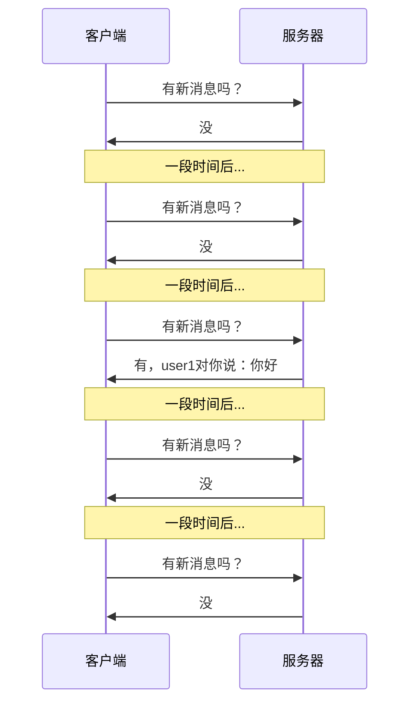
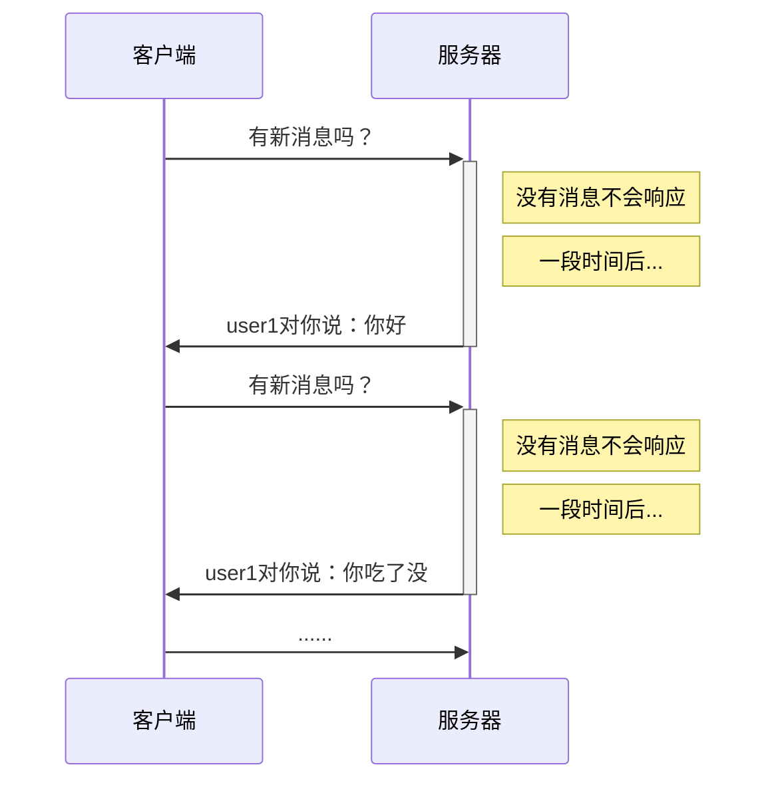

> WebSocket协议（rfc6455）原文地址：
>
> https://datatracker.ietf.org/doc/html/rfc6455

# 实时场景的旧处理方案

考虑网页中的以下场景：

- 股票K线图
- 聊天
- 警报、重要通知
- 余座
- 抢购页面的库存
- ......

上述场景有一个共同特点——**实时性**

这种对实时性有要求的页面，会带来一些问题

比如下面的聊天场景


由于HTTP协议是请求-响应模式，请求必须在前，响应必须在后，这就导致了服务器无法「主动」的把消息告诉客户端。

开发者想了很多办法来解决这一问题

当然终极解决方案自然是WebSocket，但了解过去的一些做法、参观前辈们经历的痛苦还是有益的。

## 短轮询 short polling

短轮询是一种「话痨式」的方式

客户端每隔一小段时间就向服务器请求一次，询问有没有新消息



实现短轮询是非常简单的，客户端只需要设置一个计时器不断发送请求即可

这种方案的缺陷是非常明显的：

- 会产生大量无意义的请求
- 会频繁打开关闭连接
- 实时性并不高

## 长轮询 long polling

我们的前辈在有限的条件下，充分发挥智慧，来解决短轮询的问题，于是演化为**长轮询**



长轮询有效的解决了「话痨问题」，让每一次请求和响应都是有意义的

但长轮询仍然存在问题：

- 客户端长时间收不到响应会导致超时，从而主动断开和服务器的连接

  > 这种情况是可以处理的，但ajax请求因为超时而结束时，立即重新发送请求到服务器
  >
  > 虽然这种做法会让之前的请求变得无意义，但毕竟比短轮询好多了

- 由于客户端可能「过早的」请求了服务器，服务器不得不挂起这个请求直到新消息的出现。这会让服务器长时间的占用资源却没什么实际的事情可做。

# WebSocket

伴随着HTML5出现的WebSocket，从**协议**上赋予了服务器主动推送消息的能力


从上图可以看出：

- WebSocket也是建立在TCP协议之上的，利用的是TCP全双工通信的能力
- 使用WebSocket，会经历两个阶段：握手阶段、通信阶段

虽然优于轮询方案，但WebSocket仍然是有缺点的：

- 兼容性

  WebSocket是HTML5新增的内容，因此古董版本的浏览器并不支持

- 维持TCP连接需要耗费资源

  对于那些消息量少的场景，维持TCP连接确实会造成资源的浪费

  > 为了充分利用TCP连接的资源，在使用了WebSocket的页面，可以放弃ajax，都用WebSocket进行通信，当然这会带来程序设计上的一些问题，需要权衡。

## 握手

> WebSocket协议是一个高扩展性的协议，详细内容会比较复杂，这里仅讲解面试中会问到的握手协议

当客户端需要和服务器使用WebSocket进行通信时，首先会使用**HTTP协议**完成一次特殊的请求-响应，这一次请求-响应就是**WebSocket握手**

在握手阶段，首先由客户端向服务器发送一个请求，请求地址格式如下：

```shell
# 使用HTTP
ws://mysite.com/path
# 使用HTTPS
wss://mysite.com/path
```

请求头如下：

```css
Connection: Upgrade /* 嘿，后续咱们别用HTTP了，升级吧 */
Upgrade: websocket /* 我们把后续的协议升级为websocket */
Sec-WebSocket-Version: 13 /* websocket协议版本就用13好吗？ */
Sec-WebSocket-Key: YWJzZmFkZmFzZmRhYw== /* 暗号：天王盖地虎 */
```

服务器如果同意，就应该响应下面的消息

```css
HTTP/1.1 101 Switching Protocols /* 换，马上换协议 */
Connection: Upgrade /* 协议升级了 */
Upgrade: websocket /* 升级到websocket */
Sec-WebSocket-Accept: ZzIzMzQ1Z2V3NDUyMzIzNGVy /* 暗号：小鸡炖蘑菇 */
```

**握手完成，后续消息收发不再使用HTTP，任何一方都可以主动发消息给对方**


# 面试题

1. webSocket 协议是什么，能简述一下吗？

   > 参考答案：
   >
   > websocket 协议 HTML5 带来的新协议，相对于 http，它是一个持久连接的协议，它利用 http 协议完成握手，然后通过 TCP 连接通道发送消息，使用 websocket 协议可以实现服务器主动推送消息。
   >
   > 首先，客户端若要发起 websocket 连接，首先必须向服务器发送 http 请求以完成握手，请求行中的 path 需要使用`ws:`开头的地址，请求头中要分别加入`upgrade、connection、Sec-WebSocket-Key、Sec-WebSocket-Version`标记
   >
   > 然后，服务器收到请求后，发现这是一个 websocket 协议的握手请求，于是响应行中包含`Switching Protocols`，同时响应头中包含`upgrade、connection、Sec-WebSocket-Accept`标记
   >
   > 当客户端收到响应后即可完成握手，随后使用建立的 TCP 连接直接发送和接收消息。

2. webSocket 与传统的 http 有什么优势

   > 参考答案：
   >
   > 当页面中需要观察实时数据的变化（比如聊天、k 线图）时，过去我们往往使用两种方式完成
   >
   > 第一种是短轮询，即客户端每隔一段时间就向服务器发送消息，询问有没有新的数据
   >
   > 第二种是长轮询，发起一次请求询问服务器，服务器可以将该请求挂起，等到有新消息时再进行响应。响应后，客户端立即又发起一次请求，重复整个流程。
   >
   > 无论是哪一种方式，都暴露了 http 协议的弱点，即响应必须在请求之后发生，服务器是被动的，无法主动推送消息。而让客户端不断的发起请求又白白的占用了资源。
   >
   > websocket 的出现就是为了解决这个问题，它利用 http 协议完成握手之后，就可以与服务器建立持久的连接，服务器可以在任何需要的时候，主动推送消息给客户端，这样占用的资源最少，同时实时性也最高。

3. 前端如何实现即时通讯？

   > 参考答案：
   >
   > 1. 短轮询。即客户端每隔一段时间就向服务器发送消息，询问有没有新的数据
   > 2. 长轮询，发起一次请求询问服务器，服务器可以将该请求挂起，等到有新消息时再进行响应。响应后，客户端立即又发起一次请求，重复整个流程。
   > 3. websocket，握手完毕后会建立持久性的连接通道，随后服务器可以在任何时候推送新消息给客户端
