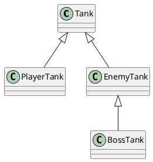
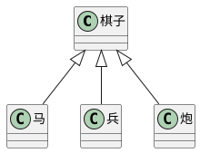

# 深入理解类和接口 {ignore=true}

[toc]

# 面向对象概述

## 为什么要讲面向对象

1. TS为前端面向对象开发带来了契机

JS语言没有类型检查，如果使用面向对象的方式开发，会产生大量的接口，而大量的接口会导致调用复杂度剧增，这种复杂度必须通过严格的类型检查来避免错误，尽管可以使用注释或文档或记忆力，但是它们没有强约束力。

TS带来了完整的类型系统，因此开发复杂程序时，无论接口数量有多少，都可以获得完整的类型检查，并且这种检查是据有强约束力的。

2. 面向对象中有许多非常成熟的模式，能处理复杂问题

在过去的很多年中，在大型应用或复杂领域，面向对象已经积累了非常多的经验。

## 什么是面向对象

面向对象：Oriented（基于） Object（事物），简称OO。

是一种编程思想，它提出一切以类对切入点思考问题。

其他编程思想：面向过程、函数式编程

> 学开发最重要最难的是什么？思维

面向过程：以功能流程为思考切入点，不太适合大型应用

函数式编程：以数学运算为思考切入点

面向对象：以划分类为思考切入点。类是最小的功能单元

类：可以产生对象的模板。

## 如何学习

1. TS中的OOP （面向对象编程，Oriented Object Programing）
2. 小游戏练习

理解 -> 想法 -> 实践 -> 理解 -> ....


# 类的继承

## 继承的作用

继承可以描述类与类之间的关系

> 坦克、玩家坦克、敌方坦克
> 玩家坦克是坦克，敌方坦克是坦克

如果A和B都是类，并且可以描述为A是B，则A和B形成继承关系：

- B是父类，A是子类
- B派生A，A继承自B
- B是A的基类，A是B的派生类

如果A继承自B，则A中自动拥有B中的所有成员



## 成员的重写

重写(override)：子类中覆盖父类的成员

子类成员不能改变父类成员的类型

无论是属性还是方法，子类都可以对父类的相应成员进行重写，但是重写时，需要保证类型的匹配。

注意this关键字：在继承关系中，this的指向是动态——调用方法时，根据具体的调用者确定this指向

super关键字：在子类的方法中，可以使用super关键字读取父类成员

## 类型匹配

鸭子辨型法

子类的对象，始终可以赋值给父类

面向对象中，这种现象，叫做里氏替换原则

如果需要判断一个数据的具体子类类型，可以使用instanceof

## protected修饰符

readonly：只读修饰符

访问权限修饰符：private public protected

protected: 受保护的成员，只能在自身和子类中访问

## 单根性和传递性

单根性：每个类最多只能拥有一个父类

传递性：如果A是B的父类，并且B是C的父类，则，可以认为A也是C的父类


# 抽象类

## 为什么需要抽象类



有时，某个类只表示一个抽象概念，主要用于提取子类共有的成员，而不能直接创建它的对象。该类可以作为抽象类。

给类前面加上```abstract```，表示该类是一个抽象类，不可以创建一个抽象类的对象。

## 抽象成员

父类中，可能知道有些成员是必须存在的，但是不知道该成员的值或实现是什么，因此，需要有一种强约束，让继承该类的子类，必须要实现该成员。

**抽象类中**，可以有抽象成员，这些抽象成员必须在子类中实现

## 设计模式 - 模板模式

设计模式：面对一些常见的功能场景，有一些固定的、经过多年实践的成熟方法，这些方法称之为设计模式。

模板模式：有些方法，所有的子类实现的流程完全一致，只是流程中的某个步骤的具体实现不一致，可以将该方法提取到父类，在父类中完成整个流程的实现，遇到实现不一致的方法时，将该方法做成抽象方法。


# 静态成员

## 什么是静态成员

静态成员是指，附着在类上的成员（属于某个构造函数的成员）

使用static修饰的成员，是静态成员

实例成员：对象成员，属于某个类的对象

静态成员：非实例成员，属于某个类

## 静态方法中的this

实例方法中的this指向的是**当前对象**

而静态方法中的this指向的是**当前类**

## 设计模式 - 单例模式

单例模式：某些类的对象，在系统中最多只能有一个，为了避免开发者造成随意创建多个类对象的错误，可以使用单例模式进行强约束。

# 再谈接口

接口用于约束类、对象、函数，是一个类型契约。

> 有一个马戏团，马戏团中有很多动物，包括：狮子、老虎、猴子、狗，这些动物都具有共同的特征：名字、年龄、种类名称，还包含一个共同的方法：打招呼，它们各自有各自的技能，技能是可以通过训练改变的。狮子和老虎能进行火圈表演，猴子能进行平衡表演，狗能进行智慧表演

> 马戏团中有以下常见的技能：

> - 火圈表演：单火圈、双火圈
> - 平衡表演：独木桥、走钢丝
> - 智慧表演：算术题、跳舞

不适用接口实现时：

- 对能力（成员函数）没有强约束力
- 容易将类型和能力耦合在一起

系统中缺少对能力的定义 —— 接口

面向对象领域中的接口的语义：表达了某个类是否拥有某种能力

某个类具有某种能力，其实，就是实现了某种接口

类型保护函数：通过调用该函数，会触发TS的类型保护，该函数必须返回boolean

接口和类型别名的最大区别：接口可以被类实现，而类型别名不可以

> 接口可以继承类，表示该类的所有成员都在接口中。