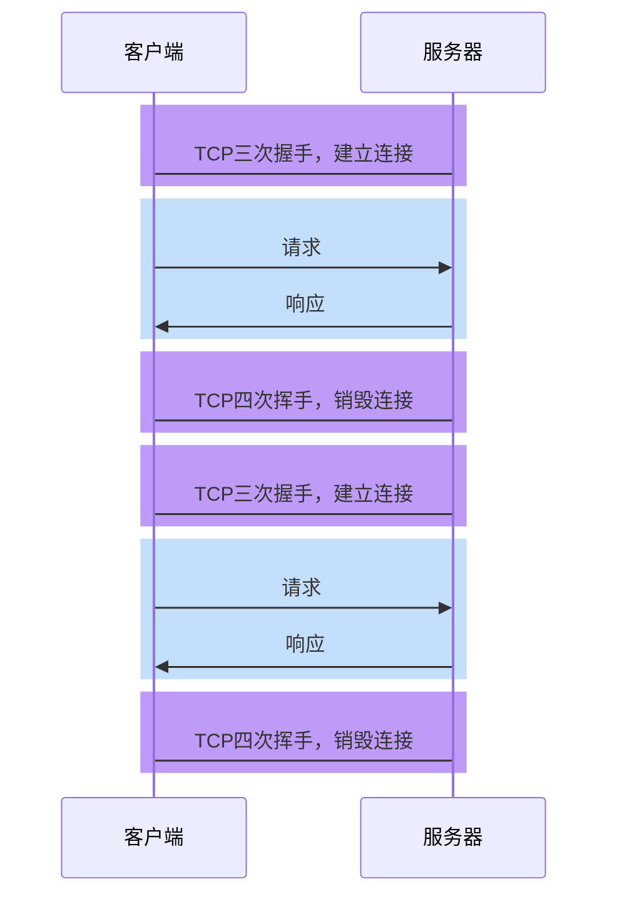
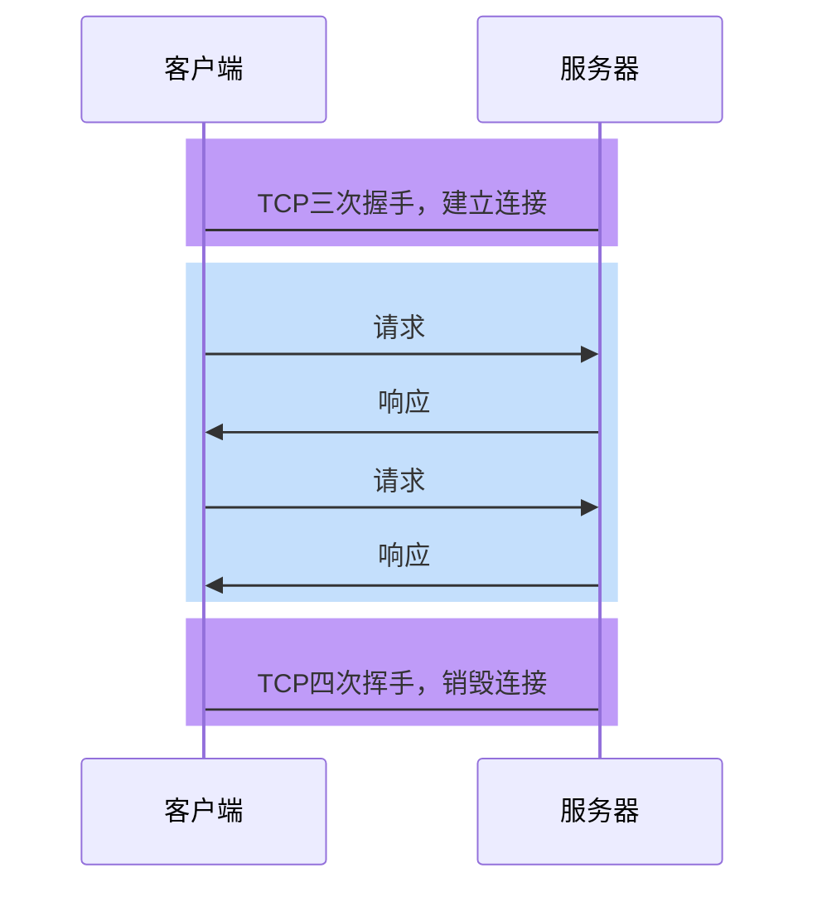

# HTTP1.0

## 无法复用连接

HTTP1.0为每个请求单独新开一个TCP连接



由于每个请求都是独立的连接，因此会带来下面的问题：

1. 连接的建立和销毁都会占用服务器和客户端的资源，造成内存资源的浪费

2. 连接的建立和销毁都会消耗时间，造成响应时间的浪费

3. 无法充分利用带宽，造成带宽资源的浪费

   > TCP协议的特点是「慢启动」，即一开始传输的数据量少，一段时间之后达到传输的峰值。而上面这种做法，会导致大量的请求在TCP达到传输峰值前就被销毁了

## 队头阻塞


# HTTP1.1

## 长连接

为了解决HTTP1.0的问题，**HTTP1.1默认开启长连接**，即让同一个TCP连接服务于多个请求-响应。



在这种情况下，多次请求响应可以共享同一个TCP连接，这不仅减少了TCP的握手和挥手时间，同时可以充分利用TCP「慢启动」的特点，有效的利用带宽。

> 实际上，在HTTP1.0后期，虽然没有官方标准，但开发者们慢慢形成了一个共识：
>
> **只要请求头中包含Connection:keep-alive，就表示客户端希望开启长连接，希望服务器响应后不要关闭TCP连接。如果服务器认可这一行为，即可保持TCP连接。**

当需要的时候，任何一方都可以关闭TCP连接

> 扩展知识
>
> 连接关闭的情况主要有三种：
>
> 1. 客户端在某一次请求中设置了`Connection:close`，服务器收到此请求后，响应结束立即关闭TCP
> 2. 在没有请求时，客户端会不断对服务器进行心跳检测（一般每隔1秒）。一旦心跳检测停止，服务器立即关闭TCP
> 3. 当客户端长时间没有新的请求到达服务器，服务器会主动关闭TCP。运维人员可以设置该时间。

由于一个TCP连接可以承载多次请求响应，并在一段时间内不会断开，因此这种连接称之为长连接。

## 管道化和队头阻塞

HTTP1.1允许在响应到达之前发送下一个请求，这样可以大幅缩减带宽限制时间

**但这样做会存在队头阻塞的问题**


由于多个请求使用的是同一个TCP连接，**服务器必须按照请求到达的顺序进行响应**

> 想一想为什么？

于是，导致了一些后发出的请求，无法在处理完成后响应，产生了等待的时间，而这段时间的带宽可能是空闲的，这就造成了带宽的浪费

队头阻塞虽然**发生在服务器**，但这个问题的根源是客户端无法知晓服务器的响应是针对哪个请求的。

正是由于存在队头阻塞，我们常常使用下面的手段进行优化：

- 通过减少文件数量，从而减少队头阻塞的几率

- 通过开辟多个TCP连接，实现真正的、有缺陷的并行传输

  > 浏览器会根据情况，为打开的页面自动开启TCP连接，对于同一个域名的连接最多6个
  >
  > 如果要突破这个限制，就需要把资源放到不同的域中

**然而，管道化并非一个成功的模型，它带来的队头阻塞造成非常多的问题，所以现代浏览器默认是关闭这种模式的**

# HTTP2.0


## 二进制分帧

HTTP2.0可以允许以更小的单元传输数据，每个传输单元称之为**帧**，而每一个请求或响应的完整数据称之为**流**，每个流有自己的编号，每个帧会记录所属的流。

比如，服务器连续接到了客户端的两个请求，一个请求JS、一个请求CSS，两个文件如下：

```js
function a(){}
function b(){}
```

```css
.container{}
.list{}
```

最终形成的帧可能如下


可以看出，每个帧都带了一个头部，记录了流的ID，这样做就能够准确的知道这一帧数据是属于哪个流的。


这样就真正的解决了共享TCP连接时的队头阻塞问题，实现了真正的**多路复用**

不仅如此，由于传输时是以帧为单元传输的，无论是响应还是请求，都可以实现并发处理，即不同的传输可以交替进行。

由于进行了分帧，还可以设置传输优先级。

## 头部压缩

HTTP2.0之前，所有的消息头都是以字符的形式完整传输的

可实际上，大部分头部信息都有很多的重复

为了解决这一问题，HTTP2.0使用头部压缩来减少消息头的体积


对于两张表都没有的头部，则使用Huffman编码压缩后进行传输，同时添加到动态表中

## 服务器推

HTTP2.0允许在客户端没有主动请求的情况下，服务器预先把资源推送给客户端

当客户端后续需要请求该资源时，则自动从之前推送的资源中寻找

# 面试题

1. 介绍下 `http1.0`、`http1.1`、`http2.0` 协议的区别？

   > 参考答案：
   >
   > 首先说 http1.0
   >
   > 它的特点是每次请求和响应完毕后都会销毁 TCP 连接，同时规定前一个响应完成后才能发送下一个请求。这样做有两个问题：
   >
   > 1. 无法复用连接
   >
   >    每次请求都要创建新的 TCP 连接，完成三次握手和四次挥手，网络利用率低
   >
   > 2. 队头阻塞
   >
   >    如果前一个请求被某种原因阻塞了，会导致后续请求无法发送。
   >
   > 然后是 http1.1
   >
   > http1.1 是 http1.0 的改进版，它做出了以下改进：
   >
   > 1. 长连接
   >
   >    http1.1 允许在请求时增加请求头`connection:keep-alive`，这样便允许后续的客户端请求在一段时间内复用之前的 TCP 连接
   >
   > 2. 管道化
   >
   >    基于长连接的基础，管道化可以不等第一个请求响应继续发送后面的请求，但响应的顺序还是按照请求的顺序返回。
   >
   > 3. 缓存处理
   >
   >    新增响应头 cache-control，用于实现客户端缓存。
   >
   > 4. 断点传输
   >
   >    在上传/下载资源时，如果资源过大，将其分割为多个部分，分别上传/下载，如果遇到网络故障，可以从已经上传/下载好的地方继续请求，不用从头开始，提高效率
   >
   > 最后是 http2.0
   >
   > http2.0 进一步优化了传输效率，它主要有以下改进：
   >
   > 1. 二进制分帧
   >
   >    将传输的消息分为更小的二进制帧，每帧有自己的标识序号，即便被随意打乱也能在另一端正确组装
   >
   > 2. 多路复用
   >
   >    基于二进制分帧，在同一域名下所有访问都是从同一个 tcp 连接中走，并且不再有队头阻塞问题，也无须遵守响应顺序
   >
   > 3. 头部压缩
   >
   >    http2.0 通过字典的形式，将头部中的常见信息替换为更少的字符，极大的减少了头部的数据量，从而实现更小的传输量
   >
   > 4. 服务器推
   >
   >    http2.0 允许服务器直接推送消息给客户端，无须客户端明确的请求
   
2. 为什么 HTTP1.1 不能实现多路复用（腾讯）

   > 参考答案：
   >
   > HTTP/1.1 的传输单元是整个响应文本，因此接收方必须按序接收完所有的内容后才能接收下一个传输单元，否则就会造成混乱。而HTTP2.0的传输单元更小，是一个二进制帧，而且每个帧有针对所属流的编号，这样即便是不同的流交替传输，也可以很容易区分出每个帧是属于哪个流的。

3. 简单讲解一下 http2 的多路复用（网易）

   > 在 HTTP/2 中，有两个非常重要的概念，分别是帧（frame）和流（stream）。 帧代表着最小的数据单位，每个帧会标识出该帧属于哪个流，流也就是多个帧组成的数据流。 多路复用，就是在一个 TCP 连接中可以存在多条流。换句话说，也就是可以发送多个请求，对端可以通过帧中的标识知道属于哪个请求。通过这个技术，可以避免 HTTP 旧版本中的队头阻塞问题，极大的提高传输性能。

4. http1.1 是如何复用 tcp 连接的？（网易）

   > 客户端请求服务器时，通过请求行告诉服务器使用的协议是 http1.1，同时在请求头中附带`connection:keep-alive`（为保持兼容），告诉服务器这是一个长连接，后续请求可以重复使用这一次的 TCP 连接。
   >
   > 这样做的好处是减少了三次握手和四次挥手的次数，一定程度上提升了网络利用率。但由于 http1.1 不支持多路复用，响应顺序必须按照请求顺序抵达客户端，不能真正实现并行传输，因此在 http2.0 出现之前，实际项目中往往把静态资源，比如图片，分发到不同域名下的资源服务器，以便实现真正的并行传输。

5. http1.0、http2.0、http3.0 之间的区别

   > 参考答案：
   >
   > http1.0
   >
   > 每次请求和响应完毕后都会销毁 TCP 连接，同时规定前一个响应完成后才能发送下一个请求。这样做有两个问题：
   >
   > 1. 无法复用连接
   >
   >    每次请求都要创建新的 TCP 连接，完成三次握手和四次挥手，网络利用率低
   >
   > 2. 队头阻塞
   >
   >    如果前一个请求被某种原因阻塞了，会导致后续请求无法发送。
   >
   > http2.0
   >
   > http2.0 优化了传输效率，它主要有以下改进：
   >
   > 1. 二进制分帧
   >
   >    将传输的消息分为更小的二进制帧，每帧有自己的标识序号，即便被随意打乱也能在另一端正确组装
   >
   > 2. 多路复用
   >
   >    基于二进制分帧，在同一域名下所有访问都是从同一个 tcp 连接中走，并且不再有队头阻塞问题，也无须遵守响应顺序
   >
   > 3. 头部压缩
   >
   >    http2.0 通过字典的形式，将头部中的常见信息替换为更少的字符，极大的减少了头部的数据量，从而实现更小的传输量
   >
   > 4. 服务器推
   >
   >    http2.0 允许服务器直接推送消息给客户端，无须客户端明确的请求
   >
   > http3.0
   >
   > http3.0 目前还在草案阶段，它完全抛弃了 TCP 协议，转而使用 UDP 协议，是为了进一步提升性能。
   >
   > 虽然 http2.0 进行了大量的优化，但它无法摆脱 TCP 协议本身的问题，比如建立连接时间长、对头阻塞问题等等。
   >
   > 为了保证传输的可靠性，http3.0 使用了 QUIC 协议。

